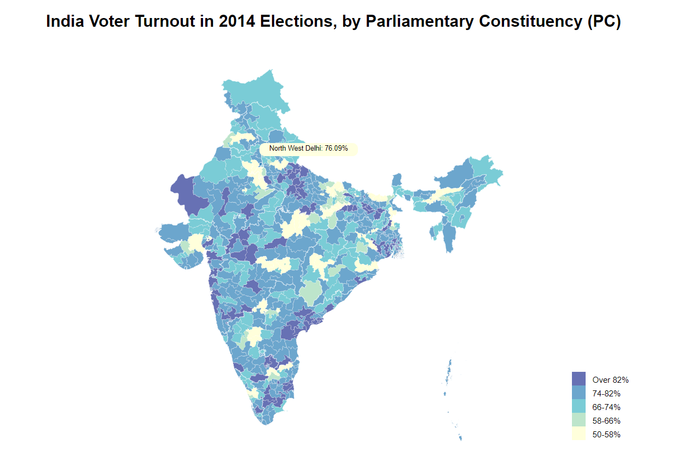

## India Voter Turnout 2014 Elections Map
This project was formed due to an interest in working with data from the recent 2019 elections. The data was taken from the Election Commission of India site. Actually, the most recent data on voter turnout there is from 2014, which is what led to the development of this map and is what I used. The data file I used from the Election Commission of India site contains information for each of India's then 543 parliamentary constituencies (PC's).

I am planning on doing a second, related project, that uses a web-scraping app to obtain data on which parties were victorious in each constituency and then uses this data to create an electoral map, colored not according to voter turnout but according to the party elected in each constituency.

## Map Loading

MENTION DRAWBACK OF LONG LOADING TIME

## Map Features
The map is 
MENTION COLORING

MENTION TOOLTIP AND LEGEND

## Creating the Geographical Data File

GIVE INSTRUCTIONS FOR SOMEONE INTERESTED IN MERGING SHAPEFILES

MENTION MANUAL EDITING I DID TO FIX INCONSISTENCIES IN STATE NAMES (Delhi, which is a Union Territory, and Orissa)

## Sources
- I closely followed the code for the D3 choropleth map here: http://bl.ocks.org/KoGor/5685876.
- Again, I used http://colorbrewer2.org/ for map colors.
- Voter turnout data for the 2014 General Election is taken from the official Election Commission of India site under their "Statistical Reports", specifically here: https://eci.gov.in/files/file/2840-constituencypc-wise-summary-table/.
- Shapefiles for 2014 parliamentary constituencies are found here: https://pub.uni-bielefeld.de/data/2674065. 