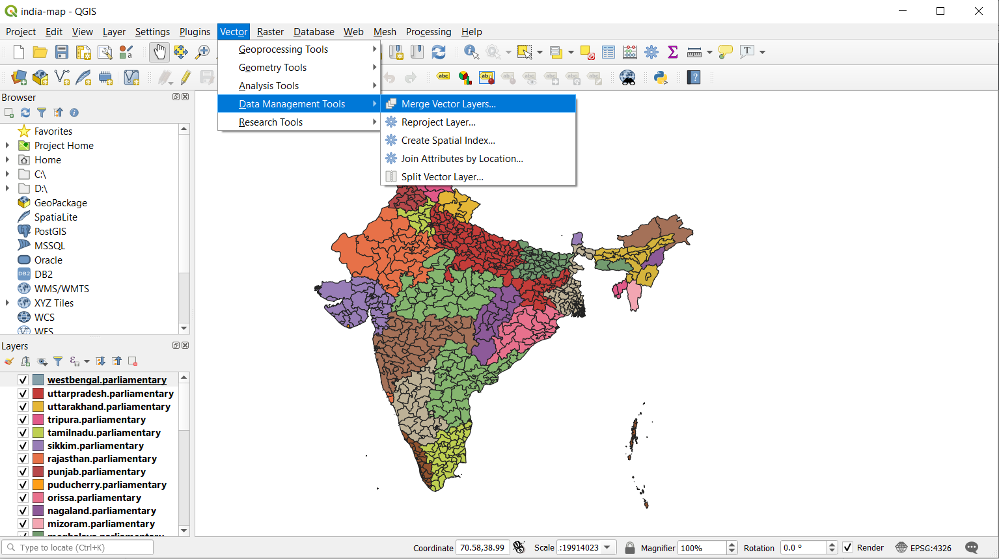

## India Voter Turnout 2014 Elections Map
This project was formed due to an interest in working with data from the recent 2019 elections. The data was taken from the Election Commission of India site. Actually, the most recent data on voter turnout there is from 2014, which is what led to the development of this map and is what I used. The data file I used from the Election Commission of India site contains information for each of India's then 543 parliamentary constituencies (PC's).

I am planning on doing a second, related project, that uses a web-scraping app to obtain data on which parties were victorious in each constituency and then uses this data to create an electoral map, colored not according to voter turnout but according to the party elected in each constituency.

## Map Features
The map is colored according to voter turnout in each constituency: darker colors indicate a higher voter turnout. I added a tooltip which displays the name of the parliamentary constituency and its percentage of votes by eligible voters when moused over, and there is also a legend for the map.

## Creating the Geographical Data File

Creating the final geographical data file was a bit of a process, starting with shapefiles, then merging them, then creating a GeoJSON and finally creating a TopoJSON file, which I will describe in case someone is interested in a similar project.

Shapefiles can be merged (as in my case, where I had a shapefile for each state or union territory) using QGIS which is free software. Using QGIS, simply go to the toolbar > Vector > Data Management Tools > Merge Vector Layers, select all layers as input, and click "Run". I have attached a screenshot below.

After merging the shapefiles, navigate to the newly created "Merged" layer in the side menu and right-click it. Select Export > Save Features As... and choose the GeoJSON file format. GeoJSON files can then be converted to the TopoJSON format, if necessary, using https://mapshaper.org/. TopoJSON is a smaller file format which loads more quickly, and is ideal for a project like this one with hundreds of areas that need to be loaded. Still, the final map takes several seconds to load, but using a GeoJSON format takes 20 to 25 seconds.

Finally, I did some manual editing of the voter turnout data so that it matched the state/union territory names and spelling of the TopoJSON file (Orissa was spelled as Odisha oringinally in the data file, and the capital of Delhi was changed from "NCT OF DELHI" to just "Delhi").

## Sources
- I closely followed the code for the D3 choropleth map here: http://bl.ocks.org/KoGor/5685876.
- Again, I used http://colorbrewer2.org/ for map colors.
- Voter turnout data for the 2014 General Election is taken from the official Election Commission of India site under their "Statistical Reports", specifically here: https://eci.gov.in/files/file/2840-constituencypc-wise-summary-table/.
- Shapefiles for 2014 parliamentary constituencies are found here: https://pub.uni-bielefeld.de/data/2674065.
- https://mapshaper.org/